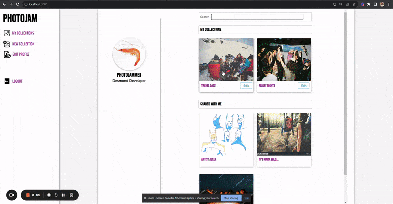

# Photojam

Photojam is a simple and easy to use platform that allows users to create and share personal coollections between close-knit circles. The application acts as something of a digital photo album allowing each user to share photos from the lense of their own personal perspective.

This application is a learning application built in the span of 2 weeks. My main goal for the application was to implement full CRUD functionality while also providing a simple yet attractive user experience utilizing React and vanilla CSS.

___
## User Experience Demo
* Given Photojam's most basic functionality, users are able to upload and view images to and from collections that they have created or have been shared with them. 
* Once a user is a member of a collection, they are able to:
    * filter images based on group members 
    * upload their own images,
    * delete images as they please. 
* The scope of user privileges (specifically the power of deletion) is determined by whether the current user is the host of that particular collection or not. This can be illustrated below.


___
## Setup

#####Prerequisite
* Photojam requires [Node.js](https://nodejs.org/en)
    * Use the above link to download the recommended version and follow any additional instructions from the download manager.

* Photojam also relies on the [cloudinary](https://cloudinary.com/) image and video hosting platform to display photos uploaded from the user's local machine.

    * The application currently interfaces through a test profile titled "photo app" on the cloudinary website, which is purely for educational purposes only, and is not secure for professional usage.

    * If you would like to establish your own profile/security keys. I highly recommend signing up through the link above (it's free), and checking out these videos below as a means of getting cloudinary up and running on your own application.
https://www.youtube.com/watch?v=Y-VgaRwWS3o&t=69s
https://www.youtube.com/watch?v=LzMXdnABrCM&t=618s

...

1. Clone this repository
2. cd into the directory
3. Install the necessary packages:
    ```bash
    npm install
    ``` 
    ```bash 
    npm install --save react react-dom react-router-dom
    ``` 
    ``` bash
    npm install json-server
    ``` 
    ``` bash
    npm install cloudinary-react
    ``` 
4. This step is optional as I've provided a sample database "database.json" in the photojam repo; however I highly recommend you run these commands:
    ``` bash
    cd .. 
    ```
    ``` bash
    mkdir photojam-api 
    ```
    ``` bash
    cd photojam-testing-api 
    ```
    ``` bash
    touch database.json 
    ```
    
    * With this you now have a seperate directory titled "photojam--testing-api", and a clean database.json file inside of it. You can copy/paste the sample code from photojam's "database.json" inside of it inside of this new directory. This way you can edit and play with the apps features as much as you want, while still maintaining a clean sample database whenever you may need it for reference.

5. After copy/pasting the database file, run:```json-server -w database.json -p 8088``` from the photojam-testing-api directory.

6. In a separate terminal, cd into the photojam directory and run ```npm start```


<!-- # Getting Started with Create React App

This project was bootstrapped with [Create React App](https://github.com/facebook/create-react-app).

## Available Scripts

In the project directory, you can run:

### `npm start`

Runs the app in the development mode.\
Open [http://localhost:3000](http://localhost:3000) to view it in your browser.

The page will reload when you make changes.\
You may also see any lint errors in the console.

### `npm test`

Launches the test runner in the interactive watch mode.\
See the section about [running tests](https://facebook.github.io/create-react-app/docs/running-tests) for more information.

### `npm run build`

Builds the app for production to the `build` folder.\
It correctly bundles React in production mode and optimizes the build for the best performance.

The build is minified and the filenames include the hashes.\
Your app is ready to be deployed!

See the section about [deployment](https://facebook.github.io/create-react-app/docs/deployment) for more information.

### `npm run eject`

**Note: this is a one-way operation. Once you `eject`, you can't go back!**

If you aren't satisfied with the build tool and configuration choices, you can `eject` at any time. This command will remove the single build dependency from your project.

Instead, it will copy all the configuration files and the transitive dependencies (webpack, Babel, ESLint, etc) right into your project so you have full control over them. All of the commands except `eject` will still work, but they will point to the copied scripts so you can tweak them. At this point you're on your own.

You don't have to ever use `eject`. The curated feature set is suitable for small and middle deployments, and you shouldn't feel obligated to use this feature. However we understand that this tool wouldn't be useful if you couldn't customize it when you are ready for it.

## Learn More

You can learn more in the [Create React App documentation](https://facebook.github.io/create-react-app/docs/getting-started).

To learn React, check out the [React documentation](https://reactjs.org/).

### Code Splitting

This section has moved here: [https://facebook.github.io/create-react-app/docs/code-splitting](https://facebook.github.io/create-react-app/docs/code-splitting)

### Analyzing the Bundle Size

This section has moved here: [https://facebook.github.io/create-react-app/docs/analyzing-the-bundle-size](https://facebook.github.io/create-react-app/docs/analyzing-the-bundle-size)

### Making a Progressive Web App

This section has moved here: [https://facebook.github.io/create-react-app/docs/making-a-progressive-web-app](https://facebook.github.io/create-react-app/docs/making-a-progressive-web-app)

### Advanced Configuration

This section has moved here: [https://facebook.github.io/create-react-app/docs/advanced-configuration](https://facebook.github.io/create-react-app/docs/advanced-configuration)

### Deployment

This section has moved here: [https://facebook.github.io/create-react-app/docs/deployment](https://facebook.github.io/create-react-app/docs/deployment)

### `npm run build` fails to minify

This section has moved here: [https://facebook.github.io/create-react-app/docs/troubleshooting#npm-run-build-fails-to-minify](https://facebook.github.io/create-react-app/docs/troubleshooting#npm-run-build-fails-to-minify) -->
